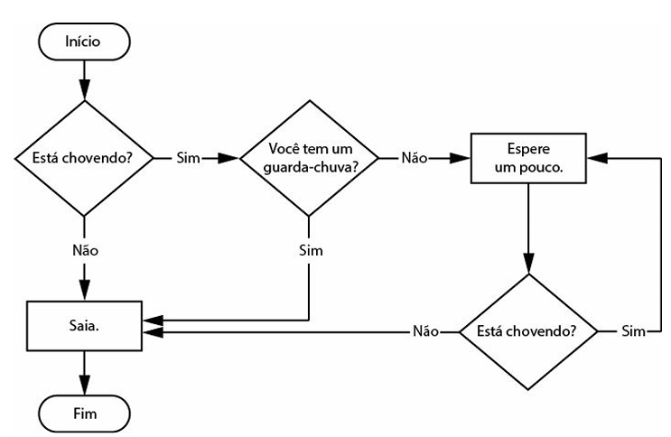

# :computer: :snake: Controle de fluxo! 



### Aula de hoje :blue_book:

Hoje vamos aprender alguns comandos. Segue o significado de cada um:

1. **Valores booleanos** 
   O tipo de dado booleano (Boolean) tem apenas dois valores: `True` e `False`. 
   
   `True`: Quer dizer que algo ou alguma comparação é verdadeira. Ex.: `(2+2) == 4`

   `False`: Quer dizer que algo ou alguma comparação é falsa. Ex.: `(-2+2) == 4`

2. **Operadores de comparação**
   Os operadores de comparação comparam dois valores e são avaliados como um único valor booleano.
   
   | Operador  | Significado       |
   |:---------:|:-----------------:|
   |  ==       | Igual a           |
   |  !=       | Diferente de      |
   |  >        | Maior que         |
   |  <        | Menor que         |
   |  <=       | Menor ou igual a  |
   |  >=       | Maior ou igual a  |

   
   :seedling: Digite no seu terminal `REPL` do python e teste:

   `4 < 3`
   deve retornar `False`

   `4 >= 4`
   deve retornar `True`

   `"joana" == "joana"` 
   deve retornar `True`

   `"joana" != "johana"`
   deve retornar `True`

3. **Qual a diferença entre = e ==?**

   `=` é um sinal de atribuição

   `==` é um operador de comparação :wink:


4. **Controlando o fluxo**
   
   `if condição:`: Usado para executar um bloco de código se a condição passada for `verdadeira`.

   Exemplo:
   ```python
   if name == "Alice":
      print("Hi, Alice")
   ```  

   `else:` : caso haja a necessidade de executar alguma instrução, caso a condição `if` for falsa, podemos usar a estrutura do else.
   
   Exemplo:
   ```python
   if name == "Alice":
      print("Hi, Alice")
   else:
      print("Hi, Estranho. Você não é Alice")
   ```

   `elif:` : Diferentemente do else, ela provê outra condição que será verificada somente se todas as condições anteriores forem False.
   
   Exemplo:
   ```python
   if name == "Alice":
      print("Hi, Alice")
   elif name == "Alicia":
      print("Hi, Alicia")
   else:
      print("Hi, Estranho. Você não é Alice e nem Alicia")
   ```

Agora siga as instruções do sua professora :heart:
Boa aula!
'''